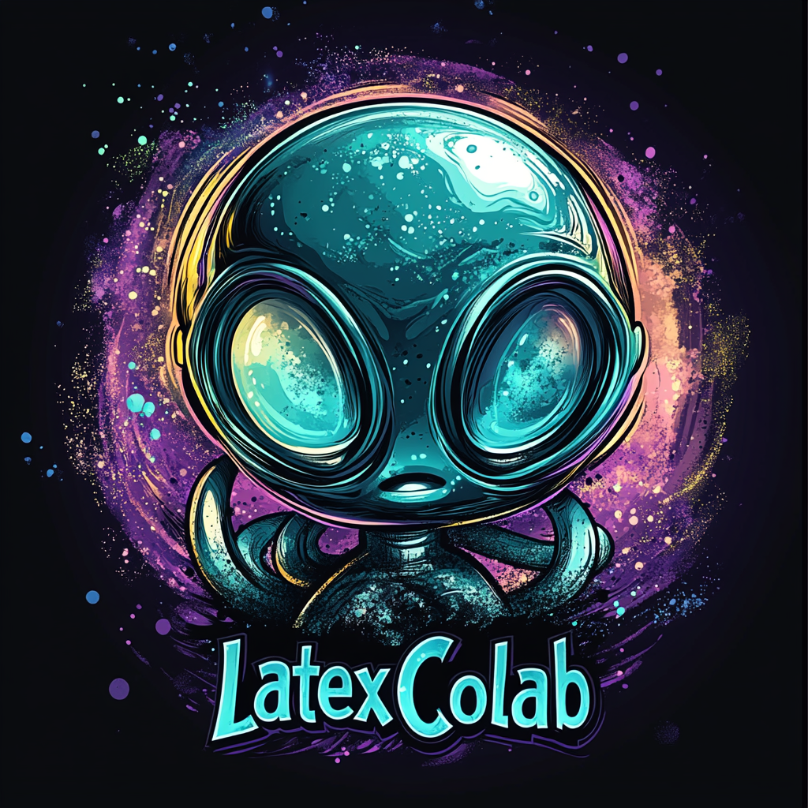
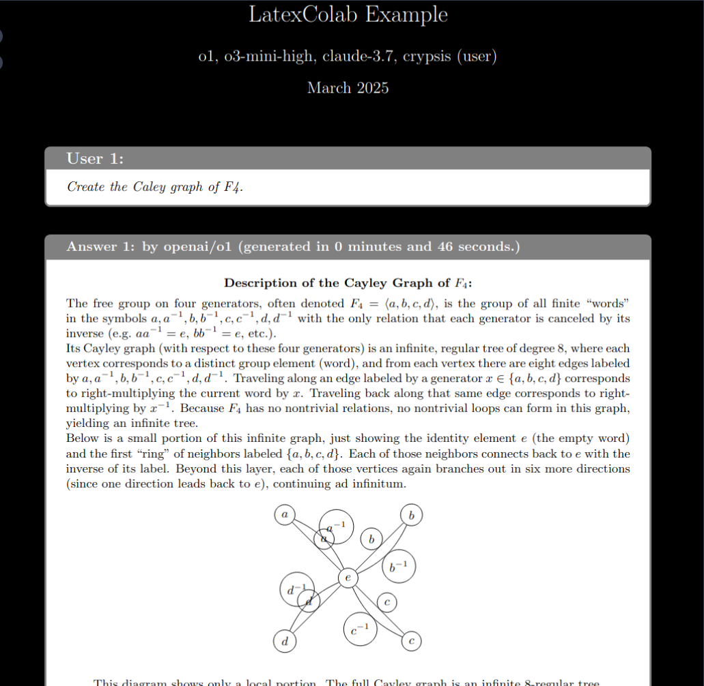
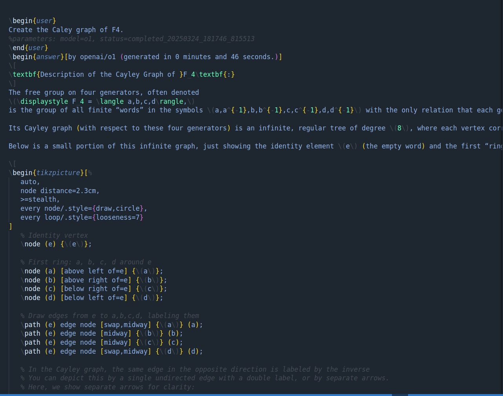
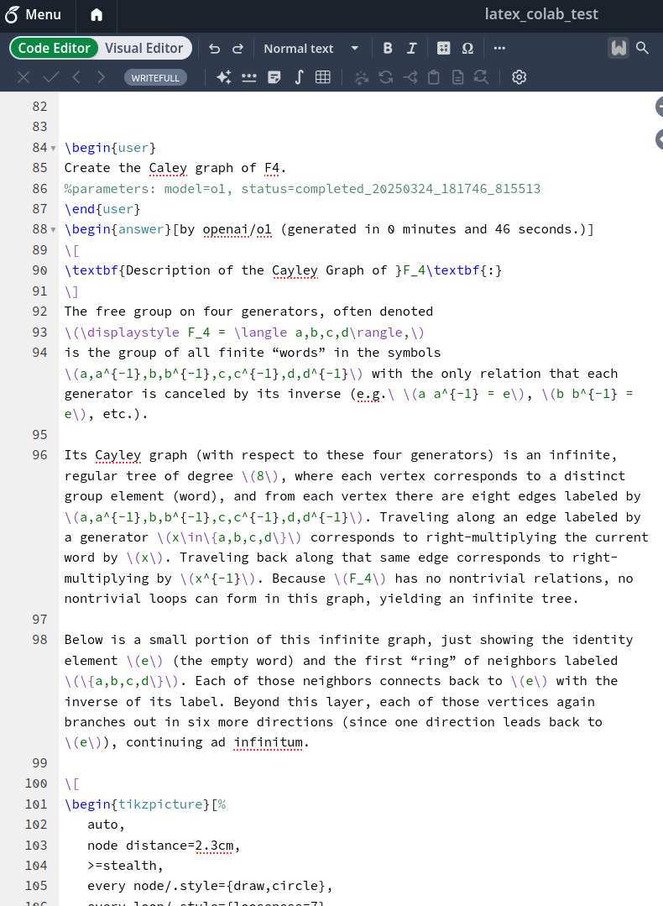

# LatexColab - Collaborative LaTeX Agent (Full App Version)


<div align="left">
  
  >
</div>

## Architecture Overview (Server + Local Client)

The current architecture consists of two main parts:

1.  **Server (`server.py`)**: Deployed (e.g., on Render), its main job is to receive updated LaTeX content from a client and synchronize it with the specified Overleaf Git repository. It handles concurrent requests using Redis for locking to prevent conflicting pushes to the same project.
2.  **Local Client (`local_client.py`)**: Run by the user on their local machine. This script reads a local `.tex` file, finds prompts marked for the AI, calls the OpenRouter API using the user's *local* API key, updates the local file with the AI's response, and finally sends the complete updated file content to the server for synchronization with Overleaf.

This architecture keeps the user's OpenRouter API key secure on their local machine.

## Deploying and Running

### 1. Deploy the Server

Follow these general steps (e.g., for Render):

*   Push the code to a Git repository (GitHub, etc.).
*   Create a Redis instance (`Key Value` store) on Render and get its Internal URL.
*   Create a Web Service on Render connected to your Git repo.
*   **Runtime**: Python 3
*   **Build Command**: `pip install -r requirements.txt`
*   **Start Command**: `uvicorn server:app --host 0.0.0.0 --port $PORT`
*   **Environment Variable**: Set `REDIS_URL` to the Internal URL of your Render Redis instance.
*   Deploy the service and note its public URL (e.g., `https://your-server-name.onrender.com`).

### 2. Run the Local Client

See the "Local Client Workflow" section below for details.

## Local Client Workflow (Recommended)

This is the primary method for interacting with the system.

### Prerequisites (Local Machine)

*   Python 3.7+
*   Git
*   Install required Python packages:
    ```bash
    pip install requests openai
    ```
*   A local copy of your `.tex` file that you want to work on.
*   Your OpenRouter API Key.
*   Your Overleaf Project's Git URL (e.g., `https://git.overleaf.com/YOUR_PROJECT_ID`).
*   An Overleaf Git Token/Password (generate from Overleaf Account Settings -> Git Access).
*   The URL of your deployed LatexColab server.

### Adding AI Prompts to your `.tex` File

To ask the AI for help, add a `user` environment block to your local `.tex` file:

```latex
\begin{user}
%parameters: status=start, model=anthropic/claude-3.5-sonnet
Please explain the difference between \textit{effect} and \textit{affect} with examples.
\end{user}
```

**Key components:**
*   `\begin{user}` and `\end{user}` tags.
*   A line starting exactly with `%parameters:`.
*   `status=start`: This tells the client to process this block.
*   `model=...` (Optional): Specify an OpenRouter model identifier (e.g., `anthropic/claude-3.5-sonnet`, `openai/gpt-4o-mini`). Defaults to Claude 3.5 Sonnet if omitted.
*   The actual prompt text for the AI.

The parameters line can appear anywhere inside the `user` block.

### Running the Client Script

Once you have added a prompt and saved your local `.tex` file, run the `local_client.py` script from your terminal:

```bash
python3 local_client.py path/to/your/local_file.tex \
    --key YOUR_OPENROUTER_API_KEY \
    --server YOUR_DEPLOYED_SERVER_URL \
    --git-url https://git.overleaf.com/YOUR_PROJECT_ID \
    --git-token YOUR_OVERLEAF_GIT_TOKEN \
    --relative-path path/within/overleaf/project/file.tex
```

**Replace the placeholders:**
*   `path/to/your/local_file.tex`: The path to the `.tex` file on your computer.
*   `YOUR_OPENROUTER_API_KEY`: Your personal OpenRouter key.
*   `YOUR_DEPLOYED_SERVER_URL`: The public URL of your server deployed in Step 1.
*   `https://git.overleaf.com/YOUR_PROJECT_ID`: Your project's Git URL.
*   `YOUR_OVERLEAF_GIT_TOKEN`: Your Overleaf Git token/password.
*   `path/within/overleaf/project/file.tex`: The path of the file *relative to the root* of your Overleaf project (e.g., `main.tex`, `sections/intro.tex`).

Add the `-v` or `--verbose` flag for detailed debugging output.

### What Happens Next

1.  The client reads your local file.
2.  It finds the `user` block with `status=start`.
3.  It calls the OpenRouter API with your prompt and key.
4.  It updates your **local file**: 
    *   The `status=start` is changed to `status=completed_<timestamp>`.
    *   New `\begin{reasoning}` and `\begin{answer}` blocks containing the AI's response are inserted immediately after the updated `\end{user}` tag.
5.  The client sends the entire modified content of your local file to the server's `/sync` endpoint.
6.  The server acquires a lock (using Redis), clones the Overleaf repo, replaces the specified file with the content received from the client, commits, and pushes the changes back to Overleaf.


## Original Workflow (Using `lc` script - Less Recommended Now)

*(This section describes the older, more complex workflow involving direct local file watching and git operations via the `lc` script and `AgenticLatexGitPush.py`. This is less recommended than the Server + Local Client approach described above)*

## Overview

LatexColab is a powerful tool that enables real-time collaboration with AI reasoning agents directly in your LaTeX documents. It maintains bidirectional synchronization between your local LaTeX files and Overleaf repositories, ensuring your work is always backed up and available.

<div align="center">
  <table>
    <tr>
      <td align="center" width="33%">
        <a href="assets/sc1.png" target="_blank">
          
          <br>
          <em>Compiled main.pdf</em>
        </a>
      </td>
      <td align="center" width="33%">
        <a href="assets/sc2.png" target="_blank">
          
          <br>
          <em>Local main.tex</em>
        </a>
      </td>
      <td align="center" width="33%">
        <a href="assets/sc3.png" target="_blank">
          
          <br>
          <em>Overleaf main.tex</em>
        </a>
      </td>
    </tr>
  </table>
  <p><em>Click any image to view full size</em></p>
</div>

## Features

- 🧠 **In-document AI collaboration**: Interact with AI models (Claude, GPT-4, etc.) directly from your LaTeX documents
- 🔄 **Bidirectional sync**: Changes made locally or on Overleaf are automatically synchronized
- 🛡️ **Fail-safe workflow**: Works with separate local and repository files to prevent data loss
- 📊 **Visual logging**: Monitor synchronization and agent activity through a clean interface
- 🧩 **Model flexibility**: Use any LLM supported by OpenRouter
- 🔍 **Reasoning transparency**: See both the reasoning process and final answer from AI models

## How It Works

LatexColab bridges the gap between your local LaTeX editor and Overleaf, while adding powerful AI assistance capabilities:

1. You maintain a local LaTeX file separate from the git repository
2. The agent monitors changes to your local file
3. When changes are detected, they are pushed to the Overleaf repository
4. When you engage the AI agent in your document, it responds directly in your LaTeX file
5. All changes are synchronized bidirectionally

## Getting Started

### Prerequisites

- Python 3.7+
- Git
- LaTeX installation
- Overleaf account with API access

### Installation

1. Clone this repository:
```bash
git clone https://github.com/yourusername/latexcolab.git
cd latexcolab
```

2. Install the required dependencies:
```bash
pip install -r requirements.txt
```

3. Set up your API keys in `set_api_keys.py`:
```python
OPENROUTER_API_KEY = "your_openrouter_api_key"
```

### Usage

The basic usage is simple:

```bash
./lc path/to/your/local_file.tex
```

To engage the AI agent, add a user environment to your LaTeX document:

```latex
\begin{user}
What is the significance of Euler's identity in mathematics?
%parameters: model=claude-3.7-sonnet, status=start
\end{user}
```

The 'model' parameter may be any of the models supported by Openrouter. An illustrative list of models may be found in [LLM_Models.py](LLM_Models.py).
Once saved, any changes in the local latex file are picked by the agent. The response would then be streamed/embedded within new 'reasoning' and 'answer' environments. Changes made remotely on the Overleaf server are pulled every 10 seconds to the local git repository (may be tweaked in AgenticLatexGitPush.py)
which may postpone the agent response. Any of these processes are logged and may be viewed in the logger window.

The agent will process your query and respond with:

```latex
\begin{reasoning}
[The agent's step-by-step reasoning process will appear here]
\end{reasoning}

\begin{answer}
[The agent's final, concise answer will appear here]
\end{answer}
```

During the reasoning phase the 'status' parameter would shift from 'start' to 'reasoning_timestamp_id' and finally 'completed_timestamp_id'.


## Latex Template Examples

See [LatexProjects/template.tex](LatexProjects/template.tex), and the example project [LatexProjects/Example](LatexProjects/Example/).


## Configuration

Edit the `lc` script to configure:

- Your Overleaf git URL
- Git credentials
- Local repository path
- Other sync parameters

For detailed instructions on obtaining Overleaf credentials, see [Overleaf_git_access.md](Overleaf_git_access.md).

## Supported Models

Any model available through OpenRouter can be used, including:

- `claude-3.7-sonnet` - Anthropic's Claude 
- `o1`, `o3-mini-high`  - OpenAI
- `deepseek-r1`

## Advanced Features

### Local Compilation

The agent can automatically compile your LaTeX documents locally:

```bash
./lc path/to/your/file.tex --local-compile --open-pdf
```

### Package Management

LatexColab can automatically install missing LaTeX packages:

```bash
./lc path/to/your/file.tex --auto-install-packages
```

## Troubleshooting

### Git Issues

If you encounter git synchronization problems:
- Ensure your Overleaf API token is correct
- Check if you have write permissions to the repository
- Verify your network connection

### Agent Not Responding

If the agent isn't responding to your queries:
- Make sure you included `status=start` in your parameters
- Check that your OpenRouter API key is valid
- Verify the model name is correct

## License

## Acknowledgments

- The Anthropic Claude team for their advanced LLM capabilities
- The Overleaf team for their excellent LaTeX collaboration platform
